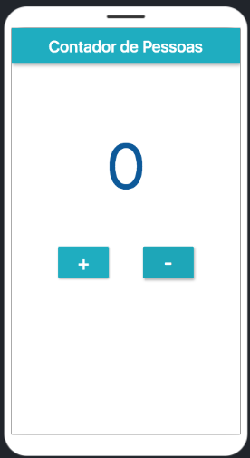
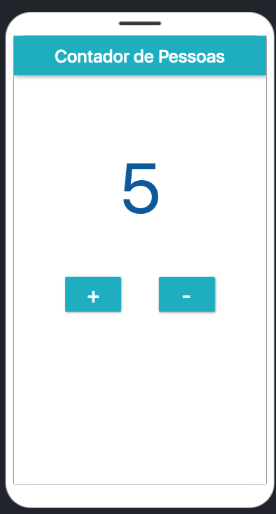

<h1 align="center">
   🚶 <a href="#"> PEOPLE COUNTER APP </a> 🚶‍♀️
</h1>

<h3 align="center">
    People counter app made with Flutter.  
</h3>

     

<h4 align="center"> 
	 Status: Finished
</h4>

 <a href="#about">About</a> •
 <a href="#features">Features</a> •
 <a href="#layout">Layout</a> • 
 <a href="#resources">Resources</a> • 
 <a href="#author">Author</a> 

## About

This people counter app was made with Flutter for a short course project.

---

## Features

- [x] Count people
- [x] Validation not allowing negative numbers

---

## Layout

  

  

---

## Resources

This project was made with the Online IDE Flutlab 
- https://flutlab.io

Getting started with Flutter
- https://flutter.dev/docs/

---

## How to contribute

1. Fork the project.
2. Create a new branch with your changes: `git checkout -b my-feature`
3. Save your changes and create a commit message telling you what you did: `git commit -m" feature: My new feature "`
4. Submit your changes: `git push origin my-feature`
> If you have any questions check this [guide on how to contribute](./CONTRIBUTING.md)

---

## Author

<a href="https://github.com/naomy19">
 
  
 <b>Camilla Naomy Tsuda</b></a> 
  

 

---

##  Versions of README

[English](./README.md)  |  [Portuguese](./README-pt.md)
